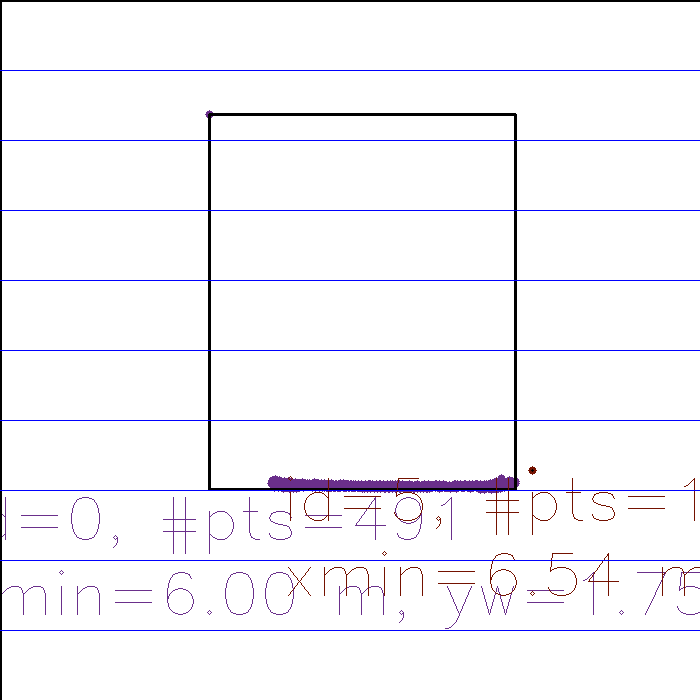
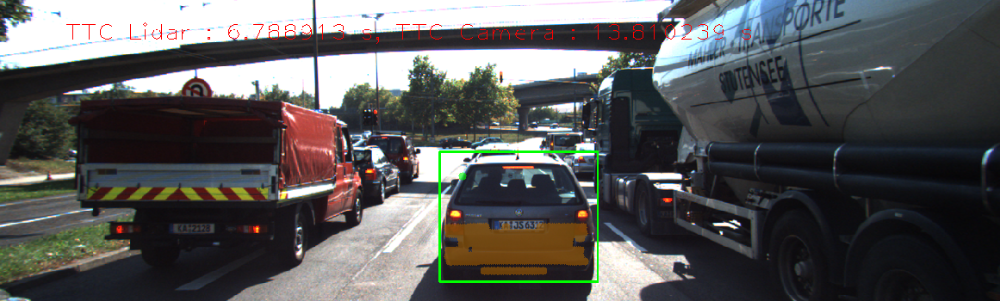
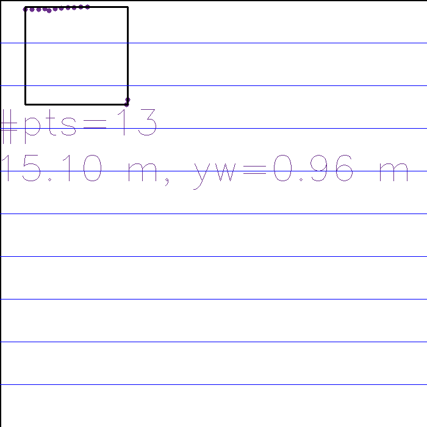
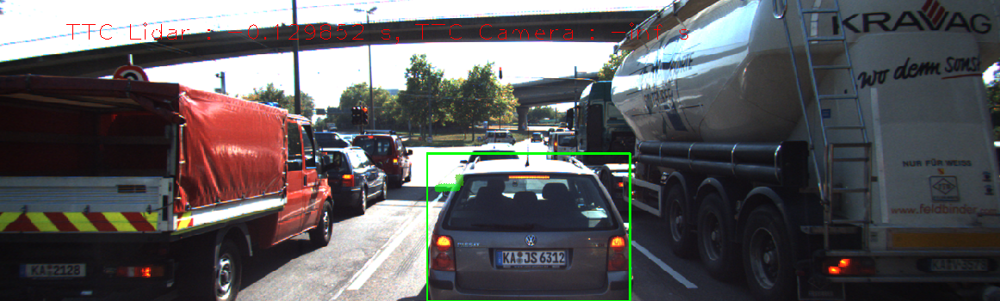

# Track an Object in 3D Space Final Project
By Josh Karon

### FP1 Match 3D Objects
The function matchBoundingBoxes was compleated. An 2d array of int was used as an accumulator to track the bounding box key point corrispondances. The rows of the accumulator refer to the index of the past bounding box and the columns refer to the index of the current bounding box. When a keypoint match is found to connect bounding boxes the accumulator is incremented in the appropriate cell. The best corispndance was selected for each current bounding box by moving down each column of the accumulator and pickin the index with the hightest accumulated value.

### FP2 Lidar TTC
The function computeTTCLidar was compleated. The median x value was calcualted for the previous and current lidar vectors and used for the TTC calculation. The median x value proved to be very robust to outliers.

### FP3 Associate Keypoints with Bounding Boxes
The function clusterKptMatchesWithROI was compleated. First the mean and standard deviation of the distances between key points were calculated and used to elimiate outliers by the 2 sigma rule. Then keypoint matches were assoicated with a bounding box if both points were within the bounding box.

### FP4 Camera TTC
The function computeTTCCamera was compleated. The distance ratios for all the key point pairs were calculate and the median distance ratio was used for the TTC calculation. 

### FP5 Preformance Evaluation 1
The main part of the car that we are interested in for a colision avoidance system is the back of the car imidatly in fron of our vehicle. However sometimes other parts of the car are detefcted by the Lidar system. In our first example the side mirror was detected as well as the rear of the car.

In this case the Lidar based TTC estimate is reasonable because the mean x-coordinate was used. Seeing as only one point was an outlier the mean did not change significantly. 

However, when more outlier points are detected the mean x-coordinate becomes less accurate and the TTC is effected.

In this next example the car in the front is too close and is not detected by the Lidar system, therefore the TTC is way off.

### FP6 Preformance Evaluation 2
The TTC calculation pipeline was preformed with various detector descriptor combinations, reuslts for the frist 15 frames are shown in Table 1. Some combinations evidently failed more than others, for example the ORB + SIFT combination retuned -inf for many of the first 15 frames. Other trials with the ORB detector aslo failed, indicating the ORB detector does not generate a sufficient number of keypoints regardless of the descriptor used. Generally the camera based TTC can be unreliable if not enough key points were generated, or if the descriptor and matching process produces incorrect matches. In the case of the ORB detector I would assume that the issue is the former seeing as the ORB detector preform pootly regardless of the descriptor being used. One combination that looks particuarly accurate in my oppionin is the SIFT - FREAK combination. Other error such as the case of FAST - BRISK in frame 4, which returned a TTC of -2880.15 was probably due to a bounding box missmatch in that given frame, seeing as all the other frames seem reasonable.

Table 1:
| Detector - Descriptor |1|2|3|4|5|6|7|8|9|10|11|12|13|14|15|
|-|-|-|-|-|-|-|-|-|-|-|-|-|-|-|-|
| SHITOMASI - BRISK |13.0927|13.1567|11.7504|12.3599|12.4072|12.561|11.7494|13.0439|10.509|14.9282|11.2358|11.5836|11.1959|11.6549|9.26461|
| SHITOMASI - BRIEF |14.4367|13.744|8.97545|14.0996|12.3866|13.2697|16.1445|11.6597|11.5952|12.2131|11.3027|11.5556|11.5556|9.94925|11.6886|
| SHITOMASI - ORB |13.8743|11.3939|11.8024|12.9162|12.0934|13.0423|12.8026|11.9209|11.2653|13.788|11.4787|11.5174|11.6839|11.426|10.6905|
| SHITOMASI - FREAK |14.2804|12.7739|9.81698|12.2613|12.2103|13.2198|10.8587|11.9646|11.2285|12.3238|11.3299|11.4126|11.6839|11.7101|9.87996|
| SHITOMASI - SIFT |13.7746|11.7823|10.4512|12.5348|11.8402|13.4234|14.2593|12.5072|12.2092|13.405|11.9864|11.5024|11.3897|11.5161|10.5005|
| FAST - BRISK |11.9559|62.5103|10.8623|-2880.15|10.9093|11.1744|11.8126|13.6055|13.4726|6.64058|11.2692|9.2556|6.75499|
| FAST - BRIEF |47.6796|9.0112|11.3348|29.4656|11.4955|11.2436|12.8711|20.1999|11.0962|6.76552|11.7063|9.43823|11.0874|
| FAST - ORB |47.6796|9.0112|11.3348|29.4656|11.4955|11.1744|11.8812|17.9109|11.8438|8.21275|11.7063|10.4448|8.29659|
| FAST - FREAK |10.8098|44.3787|12.6239|-inf|10.7456|11.3441|11.332|12.1506|28.914|5.49964|11.2246|9.03071|8.29659|
| FAST - SIFT |189.579|9.0112|13.1763|11.5155|29.4656|10.6488|11.2436|13.448|23.1598|11.0927|5.06815|11.3141|9.43823|6.84314|
| BRISK - BRISK |15.1269|26.9398|15.5819|32.515|16.2625|15.7888|11.8048|10.5512|13.4293|7.44832|14.8815|10.5968|10.8601|10.8983|
| BRISK - BRIEF |32.5537|21.9301|16.5813|29.4778|373.927|23.6244|17.3913|19.8774|10.233|14.9239|9.04923|16.477|11.7311|14.2581|8.71785|
| BRISK - ORB |25.4202|13.9169|19.8993|30.2888|19.2608|13.692|11.4586|10.233|13.8099|10.3306|14.0631|9.44574|13.6918|10.0588|
| BRISK - FREAK |15.037|97.1597|16.907|33.579|26.5114|14.4434|14.4901|10.6352|13.674|12.7576|15.3883|9.83653|12.061|9.84746|
| BRISK - SIFT |15.037|17.8373|19.1127|38.5003|18.7387|14.3644|15.8372|17.5978|12.6592|9.5461|19.7421|9.453|11.7247|10.1122|
| ORB - BRISK |-inf|14.6564|14.2428|37.5335|48.2874|-inf|10.116|-inf|20.7754|7.03139|-inf|7.19661|54.4798|-inf|
| ORB - BRIEF |15.6794|13.4941|18.4131|11.6274|-inf|8.63418|-254.876|15.1023|6.7839|-4.82296e+06|7.74427|10.5104|-inf|
| ORB - ORB |-410.825|17.6371|25.8792|24.9291|-inf|6.93773|-inf|13.3424|9.09836|12.5678|13.7328|27.133|-inf|
| ORB - FREAK |-183.016|7.85022|-9.65017|43.7858|-inf|8.91581|60.2833|14.5066|9.09836|16.8828|7.89107|32.5235|-inf|
| ORB - SIFT |-inf|-inf|26.8547|485.46|-inf|9.52908|-inf|4.54818|9.09836|-inf|7.19826|-inf|-inf|
| SIFT - BRISK |12.5124|12.2747|12.7517|17.7717|14.5191|9.14813|12.6725|12.6528|12.247|9.39425|11.0112|10.4472|9.16282|9.33191|9.41141|
| SIFT - BRIEF |11.5097|11.6483|13.9338|21.5634|13.7879|11.3573|12.8498|16.3496|11.8316|9.92912|11.7094|9.38957|8.83338|9.53231|8.61635|
| SIFT - FREAK |11.2206|12.698|12.4544|17.0721|12.2897|10.7681|13.2096|11.9603|13.679|10.0852|11.0112|10.1726|8.97686|9.50786|8.96075|
| SIFT - SIFT |11.1233|13.0746|12.6112|17.1393|13.0338|11.7801|13.2078|14.4328|12.247|10.6003|10.2882|9.99703|9.6037|9.92596|9.19013|
| AKAZE - BRISK |12.101|14.1129|13.3123|14.2527|13.8267|15.0888|15.778|14.3625|13.8546|11.4554|12.1969|10.8084|10.1868|10.1041|9.48718|
| AKAZE - BRIEF |13.4143|15.1441|13.1784|14.6445|14.8877|13.6561|15.8047|14.442|14.1303|11.8964|13.1039|11.9175|10.2486|9.98247|8.91322|
| AKAZE - ORB |12.8074|14.0453|12.9853|13.9356|15.5179|14.1156|15.7918|14.1953|13.9095|11.3915|12.0593|11.1693|10.6851|10.0944|9.39105|
| AKAZE - FREAK |12.7209|13.5594|13.8031|13.8533|14.3339|13.8949|15.4391|13.7666|12.97|11.624|12.1578|10.6141|10.738|9.64042|9.06474|
| AKAZE - SIFT |12.5308|14.3455|13.1413|14.1718|16.4014|13.7732|15.4456|14.1466|14.1299|11.6481|12.6732|11.2212|10.8239|10.4413|9.65778|